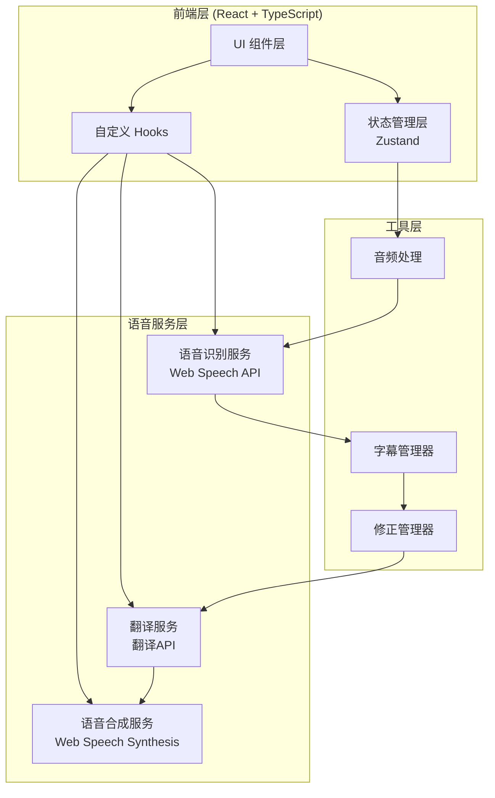

# AI 同声传译助手 - 技术架构文档

## 1. 架构设计



## 2. 技术选型

### 2.1 核心技术栈
| 技术 | 版本 | 用途 |
|------|------|------|
| React | 18.x | UI 框架 |
| TypeScript | 5.x | 类型安全 |
| Vite | 5.x | 构建工具 |
| Tailwind CSS | 3.x | 样式方案 |
| Zustand | 4.x | 状态管理 |
| Web Speech API | - | 语音识别/合成 |
| Web Audio API | - | 音频处理 |

### 2.2 目录结构
```
ai-translator/
├── index.html
├── package.json
├── vite.config.ts
├── tailwind.config.js
├── tsconfig.json
├── src/
│   ├── main.tsx
│   ├── App.tsx
│   ├── index.css
│   ├── components/
│   │   ├── AudioControls.tsx      # 音频控制组件
│   │   ├── CaptionDisplay.tsx     # 字幕显示组件
│   │   ├── Settings.tsx           # 设置面板
│   │   ├── History.tsx           # 翻译历史
│   │   └── StatusBar.tsx          # 状态栏
│   ├── hooks/
│   │   ├── useAudioRecorder.ts    # 录音 Hook
│   │   ├── useSpeechRecognition.ts # 语音识别 Hook
│   │   ├── useTranslation.ts      # 翻译 Hook
│   │   └── useSpeechSynthesis.ts  # 语音合成 Hook
│   ├── store/
│   │   └── useStore.ts            # Zustand 状态存储
│   ├── services/
│   │   ├── audioService.ts        # 音频服务
│   │   └── translationService.ts  # 翻译服务
│   ├── types/
│   │   └── index.ts               # 类型定义
│   └── utils/
│       └── helpers.ts              # 工具函数
```

## 3. 路由定义

| 路由 | 组件 | 描述 |
|------|------|------|
| / | App | 主页面（音频控制 + 字幕显示） |
| /settings | Settings | 设置页面 |

## 4. 核心类型定义

```typescript
// 翻译记录
interface TranslationRecord {
  id: string;
  original: string;         // 原文
  translated: string;        // 译文
  timestamp: number;         // 时间戳
  corrected: boolean;        // 是否被修正过
  corrections?: Correction[]; // 修正历史
}

// 修正记录
interface Correction {
  field: 'original' | 'translated';
  before: string;
  after: string;
  timestamp: number;
}

// 音频输入类型
type AudioSource = 'microphone' | 'file' | 'system';

// 语言选项
interface LanguageOption {
  code: string;
  name: string;
  nativeName: string;
}

// 应用状态
interface AppState {
  // 状态
  isRecording: boolean;
  isPaused: boolean;
  currentSource: AudioSource;
  
  // 语言
  sourceLanguage: string;
  targetLanguage: string;
  
  // 字幕
  currentOriginal: string;
  currentTranslation: string;
  records: TranslationRecord[];
  
  // 语音设置
  speechRate: number;
  speechVolume: number;
  
  // 动作
  setSource: (source: AudioSource) => void;
  setLanguage: (source: string, target: string) => void;
  addRecord: (record: TranslationRecord) => void;
  correctRecord: (id: string, correction: Correction) => void;
  setSpeechSettings: (rate: number, volume: number) => void;
}
```

## 5. 组件设计

### 5.1 AudioControls（音频控制组件）
- 音频源选择（麦克风/文件/系统）
- 语言选择下拉框
- 语速/音量滑块
- 开始/暂停/停止按钮

### 5.2 CaptionDisplay（字幕显示组件）
- 原文显示区（带时间戳）
- 译文显示区（打字机动画）
- 修正按钮（点击弹出编辑）
- 双语对照布局

### 5.3 History（历史记录组件）
- 翻译记录列表
- 支持滚动查看
- 点击跳转定位
- 导出功能

### 5.4 Settings（设置面板）
- 界面语言设置
- 主题切换
- 快捷键配置
- 关于信息

## 6. 状态管理设计

```typescript
// 使用 Zustand 进行状态管理
// 状态分为三类：
// 1. UI状态 - isRecording, isPaused, currentSource
// 2. 业务状态 - records, currentOriginal, currentTranslation
// 3. 设置状态 - sourceLanguage, targetLanguage, speechRate, speechVolume
```

## 7. 语音服务集成

### 7.1 语音识别（ASR）
- 使用 Web Speech API 的 SpeechRecognition
- 支持连续识别模式
- 实时返回识别结果

### 7.2 语音合成（TTS）
- 使用 Web Speech API 的 SpeechSynthesis
- 支持语速/音调调节
- 中文语音优先

### 7.3 翻译服务
- 集成翻译 API（可配置）
- 支持流式返回
- 错误重试机制

## 8. 性能优化

- **虚拟滚动**：历史记录列表使用虚拟滚动
- **防抖处理**：翻译请求防抖 300ms
- **内存管理**：定期清理过期记录
- **懒加载**：设置页面懒加载
